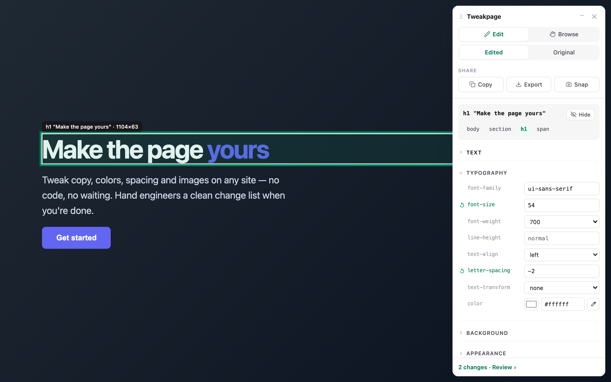

<p align="center">
  
</p>

<h1 align="center">Tweakpage</h1>

<p align="center">
  Visually edit any web page — then keep it, prove it, and hand it off.
</p>

<p align="center">
  <a href="LICENSE"></a>
  
  
</p>



Tweakpage is a Chrome extension for anyone who wants to try a page change before asking
someone to build it — designers, marketers, PMs, and engineers who'd rather not open
DevTools for a copy tweak. Every edit is recorded as a structured diff
(selector + property + old → new), not a screenshot of an idea.

## Features

- **Edit text where it lives** — double-click any text and type; inline markup (the link
  or coloured span inside a heading) survives, paste arrives as plain text.
- **Edit almost anything** — text (inline markup preserved, one box per run), typography,
  colors with an eyedropper and alpha, backgrounds, images (local file or URL), links,
  size, spacing, layout, borders, shadows, opacity — and an **Advanced** box for any CSS
  the fields don't cover, one declaration per line.
- **Reorder, duplicate, hide** — ▲▼ on the selection outline swap an element with its
  siblings; Duplicate inserts an editable copy right after it; Hide removes it
  non-destructively.
- **Apply to every similar element** — style a card once, restyle the family.
- **Compare** — flip the whole page between Edited and Original with one switch.
- **Edits persist** — saved locally per URL, replayed on reload and across client-side
  navigation. A query string that selects content (`?view=b`) counts as its own page;
  tracking parameters (`utm_*`, click ids) don't.
- **Honest pages** — a page showing edits says so with a chip in the bottom-left corner,
  whether or not the editor is open. One chip, one home: while the panel is open its
  footer carries the count; minimize or close and the chip takes over in the same spot.
- **Proposals** — save the current edits under a name and switch between directions
  without rebuilding either. They travel with exports.
- **Hand-off** — copy a Markdown change list for Slack/Jira, export/import JSON, or snap
  one image with the original and edited page side by side. Each change can carry a note — the why under the what — which travels
  with exports and share links.
- **Share links** — upload a page's edits to your own S3 bucket and send a URL.
  The recipient needs Tweakpage and nothing else. Opening a link previews; nothing is
  saved on their machine until they choose **Keep**. Images you picked from your own
  machine go up with it — optionally compressed through TinyPNG first.
- **Undo everything** — `⌘Z`/`⇧⌘Z`, per-edit toggles, per-element resets, revert all.
- **Keyboard-first friendly** — pick, navigate, resize, and edit without a mouse;
  visible text and screen-reader labels ship in English and Traditional Chinese.

## Install

Not on the Chrome Web Store yet — load it from source:

```bash
pnpm install && pnpm build   # output in .output/chrome-mv3/
```

1. Open `chrome://extensions` and enable **Developer mode** (top right).
2. Click **Load unpacked** and select the `.output/chrome-mv3` folder.

## Quick start

1. Click the **Tweakpage** toolbar icon → **Edit this page**.
2. Hover to outline, click to select. Edit in the panel's sections.
3. Reload the page — your edits replay. Footer **Review ›** lists every change.
4. Done? **Copy summary** and paste the change list into Slack or Jira.

## Guide

### Selecting

**Edit / Browse** is the top switch: Edit selects elements on hover/click; Browse lets
you use the page normally (menus, tabs, links). Holding `⌥ Alt` in Edit mode is a
temporary Browse. Use the breadcrumb in the selection card to reach parents and
children, or `⌥` + arrow keys to walk the DOM without a mouse.

### Editing

**Double-click text to edit it in place** — the element itself becomes a plain-text
input; blur, `Esc`, or clicking away commits, and the change lands in the same records
as the panel's text boxes. Long rewrites are still comfortable in the panel.

Fields are named after the CSS property they write — an edited one shows a ↺ reset
beside it, and reset restores what the page holds *now*, not a stale snapshot, even if
the site updated the value underneath you. Text with inline markup gets one box per run,
so a heading keeps the link or coloured span inside it. Image URLs apply on Enter or
blur; local files apply immediately. Color fields have an eyedropper and recent
swatches, and keep their transparency.

The selection card offers **Hide / Unhide** and **apply to every similar element**;
the ▲▼ on the selection outline reorder the element among its siblings — stepping it
back to where it started removes the edit.

### Reviewing and handing off

**Review ›** in the footer opens the change list: toggle an edit off and on, delete it,
hover to highlight its element, click to scroll to it. **Import JSON** merges a
teammate's edits — edits for other pages wait until you open those pages.

Hand off with **Copy summary** (Markdown), **Screenshot** (original and edited side by
side in one image), or **Copy / Download JSON**. **Proposals** saves the current set under a name so two directions can be
compared live.

### The panel

Drag it anywhere; resize by dragging its left edge or focusing the edge and using the
arrow keys — both remembered. Idle, it turns slightly translucent so the page shows
through, and solidifies when you reach for it. The gear opens Settings: theme
(system/light/dark) and the share-link credentials. The popup on the toolbar icon lists
every page holding saved edits — open or clear them from there.

### Keyboard shortcuts

| Keys | Action |
| --- | --- |
| `⌘Z` / `Ctrl+Z` | Undo |
| `⇧⌘Z` / `Ctrl+Shift+Z` | Redo |
| `Esc` | Deselect, then close; in Browse, return to Edit |
| hold `⌥ Alt` | Temporary Browse while in Edit |
| `⌥` + `↑ ↓ ← →` | Move selection: parent / first child / previous / next sibling |
| `← →` on the resize edge | Narrow / widen the panel (`⇧` for bigger steps) |
| `Enter` in an image URL field | Apply the URL |

## Share links

Upload a page's edits to **your own** S3 bucket and share the link. Whoever opens it
needs Tweakpage and nothing else — no AWS account, no setup.

Opening a link **shows** the edits; it does not save them. The panel says they came from
someone else and offers **Keep on this page**, which is what puts them in the reader's
own storage. Look at a colleague's proposal, close the tab, and your copy of the page is
as it was.

### Setup

Gear icon → **Share links** → fill in bucket, region, access key id and secret. They
save as you type; until all four are set, the Share link button stays disabled. This
repo ships no defaults.

### Images

An image picked from your machine is stored locally as data, which is right for this
machine and useless in a share: the bytes make the page too big to survive the import
limits, so the recipient would quietly see the original picture. Sharing therefore
lifts each image into `tweakpage/images/<sha256>.<ext>` — the same prefix as the shares,
so the policy below covers both — and sends a URL in its place. The local edit keeps its
bytes, so your own page still works offline.

Under gear icon → **Images**:

- **Upload images when sharing** — on by default. Turn it off and local images stay
  embedded, and the share tells you they will not travel.
- **TinyPNG** — paste a [tinify.com](https://tinypng.com/developers) key and switch on
  **Compress with TinyPNG first** to shrink images before they are uploaded. It sends
  the image to a third party, which is why the switch is separate from the key. If the
  month's free quota runs out or the service is down, the original is uploaded instead —
  a share is never blocked by it.

The key needs to write, and to be allowed to mark what it writes as readable:

```json
{ "Effect": "Allow", "Action": ["s3:PutObject", "s3:PutObjectAcl"],
  "Resource": "arn:aws:s3:::YOUR_BUCKET/tweakpage/*" }
```

Then the bucket has to let a stranger read a share — either a bucket policy:

```json
{ "Effect": "Allow", "Principal": "*", "Action": "s3:GetObject",
  "Resource": "arn:aws:s3:::YOUR_BUCKET/tweakpage/*" }
```

or leave ACLs enabled with Block Public Access off, and Tweakpage marks each file public
as it uploads. Either way it verifies: after writing, it reads the object back with no
credentials, exactly as a recipient would, and refuses to hand you a link that would 403.

### What to know before pasting a key

- Extension storage is not a vault: anyone with access to the browser profile can read
  what you paste, and this extension is open source. Use a key that can do nothing
  except write that one prefix, and rotate it like any other credential. The secret
  never leaves the machine — requests carry a signature derived from it.
- The object name is 113 bits of randomness, so the link is the permission — but the
  file is readable by anyone holding it. Don't share pages whose content is
  confidential. A lifecycle rule on the `tweakpage/` prefix expires old shares.
- A link carries an id, bucket and region as separate validated parts — never a URL —
  so it can only resolve to an address Tweakpage builds itself, and what arrives is
  validated exactly like an imported file.

## How it works

- A tiny always-on content script replays saved edits and draws the corner chip; the
  editor itself loads lazily into a Shadow DOM, so pages you never edit pay almost
  nothing.
- Style edits go through one injected stylesheet targeting a `data-tweakpage` marker
  stamped on the resolved element — a selector can never fan out to elements you didn't
  pick.
- Selectors prove uniqueness, not identity: a hit is held against the remembered text
  before it is believed, so a site inserting a sibling can't get the wrong element
  edited.
- Everything lives in `chrome.storage.local`, keyed by normalized URL. Nothing leaves
  the machine unless you export or share.

## Development

```bash
pnpm dev         # WXT dev mode with HMR
pnpm test        # typecheck, then unit/component tests (vitest)
pnpm typecheck   # tsc --noEmit alone
pnpm e2e         # builds, then drives the real extension in Chromium (Playwright)
```

The [release QA checklist](docs/qa-checklist.md) runs before each release. Issues and
PRs welcome — please keep both
locales in step (tests enforce it) and anchor E2E assertions on `data-testid`, never on
translated text.

## License

[MIT](LICENSE)
